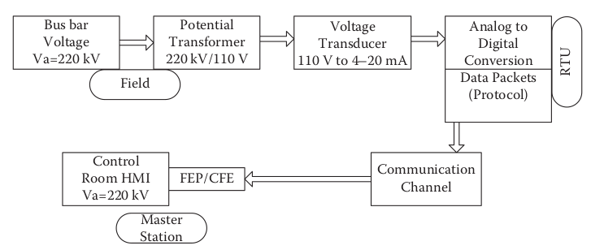
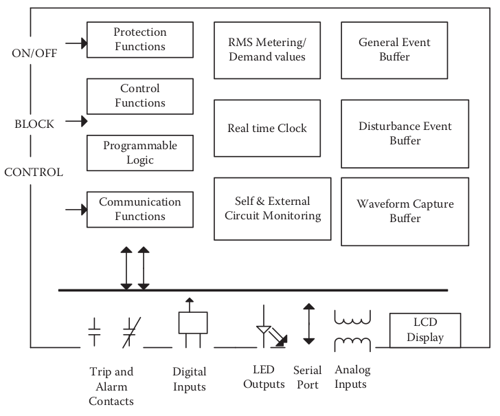
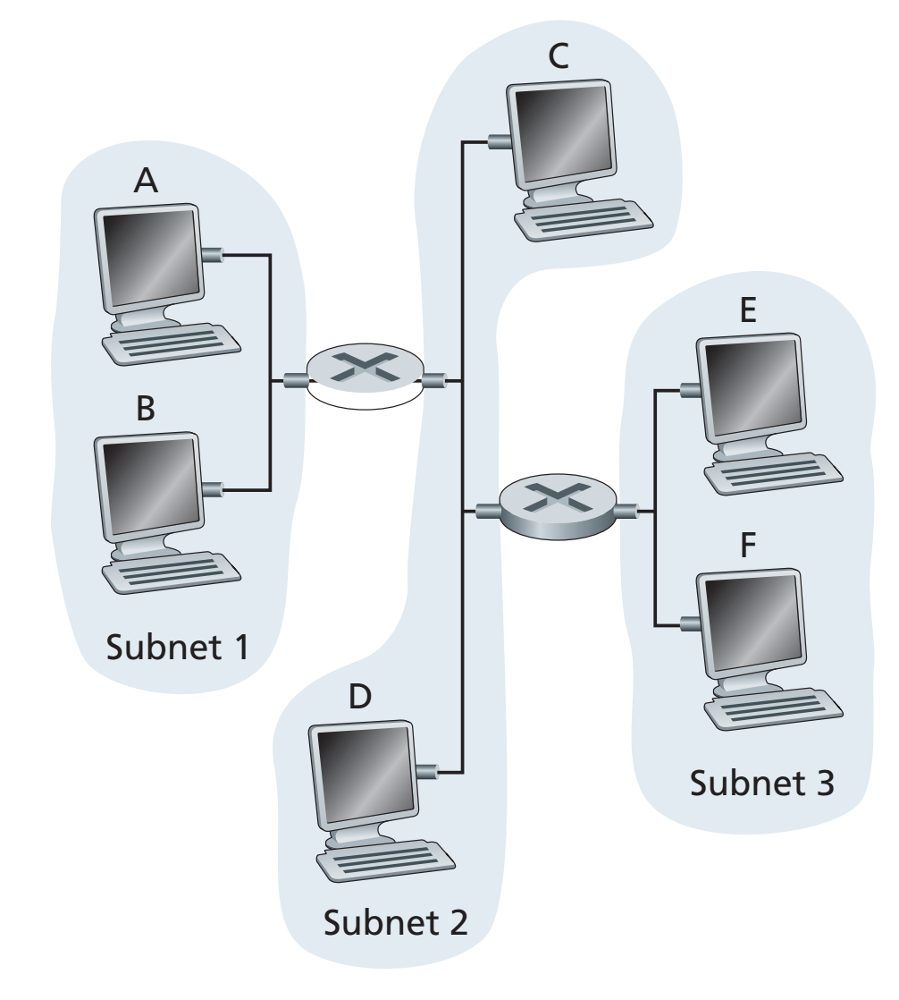

## Lista de Exercícios sobre Fundamentos de Sistemas SCADA

1. Quais os quatro níveis de automação relacionados à proteção e controle de subestações de energia elétrica, tendo em vista a possibilidade de monitoramento remoto e integrado de um conjunto de subestações? Comente sobre cada um dos níveis.

2. Com base na resposta do item anterior, descreva como a abertura de um disjuntor pode ser realizada em cada um dos níveis de automação de uma subestação. Descreva também como a atualização do estado do disjuntor é propagada em cada desses níveis via função de supervisão desse mesmo sistema.

3. Quais as tecnologias empregadas pelos relés de proteção desde sua concepção no início do século XX até os desenvolvimentos mais atuais? Descreva as principais características de cada uma.

4. De quando data o primeiro protótipo de sistema de supervisão e controle de processos industriais? Descreva suscitamente os principais avanços até os dias de hoje.

5. O que são as UTRs? Quais suas funcionalidades? Por que foram tão utilizadas na era dos relés eletromecânicos? Por que caíram em desuso? Em que situações ainda podem ser úteis? Qual sua principal diferença em relação aos modernos IEDs de proteção e controle?

6. Comente suscitamente sobre os principais protolcolos de automação utilizados no ambiente de subestações. A saber modbus, DNP 3.0, IEC 101, IEC 104, MMS, GOOSE e Sampled Values.

7. Cite 5 exemplos de pontos digitais que devem ser monitorados pelo sistema SCADA de uma SE. Especifique o equipamento a que cada ponto está associado e contextualize sua funcionalidade.

8. Cite 5 exemplos de pontos analógicos que devem ser monitorados pelo sistema SCADA de uma SE. Especifique o equipamento a que cada ponto está associado e contextualize sua funcionalidade.

9. O que é uma Merge Unit? Para que serve? Por que vem sendo tão comentada nos últimos anos?

10. Quais os principais protocolos especificados pela norma IEC 61850? Qual a funcionalidade de cada protocolo citado?

10. Qual a definição de Sistema SCADA (*Supervisory Control and Data Acsition System*)? Quais os principais elementos desse tipo de sistema? Comente sobre cada uma delas.

11. Sobre os sinais analógicos, qual o padrão mais estabelecido para trasmissão desses sinais dos equipamentos de campo para os IEDs de proteção e controle? Especifique sua resposta em relação aos transformadores de instrumentos (TCs e TPs) e em relação às grandezas secundárias como temperatura, pressão, nível de líquidos, etc.

12. Comente sobre cada um dos processos descritos na figura abaixo:

{ width=80% }

13. Comente sobre a importância do sincronismo de tempo entre os disposisitivos de proteção e controle de uma subestação. Quais os principais protocolos utilizados para esse fim?

14. Quais as duas principais técnicas de coleta de dados entre os equipamentos supervisionados e os IEDs de proteção e controle? Mencione em sua resposta as vantagens e desvantagens de cada uma.

15. Comente sobre cada uma das funcionalidades de um IED de proteção e controle mostradas na figura abaixo:

{ width=80% }

## Lista de Exercícios sobre Protocolos de Rede de Camada de Enlace

1. Quais são alguns dos serviços possíveis que um protocolo da camada de enlace pode oferecer à camada de rede? Quais desses serviços da camada de enlace têm serviços correspondentes em IP? E em TCP?

2. Suponha que dois nós comecem a transmitir ao mesmo tempo um pacote de comprimento L em um canal de transmissão de taxa R. Denote o atraso de propagação entre os dois nós como $d_{prop}$. Haverá uma colisão se $d_{prop} < L/R$? Por que sim ou por que não?

3. Qual é o tamanho do espaço de endereços MAC? E do espaço de endereço IPv4? E do espaço de endereço IPv6?

4. Suponha que os nós A, B e C se conectem à mesma LAN de broadcast (por meio de seus adaptadores). Se A enviar milhares de datagramas IP para B com cada quadro de encapsulamento endereçado ao endereço MAC de B, o adaptador de C processará esses quadros? Se sim, o adaptador de C passará os datagramas IP nesses quadros para a camada de rede C? Como suas respostas mudariam se A enviasse quadros com o endereço MAC de broadcast?

5. Por que uma consulta ARP é enviada dentro de um quadro de broadcast? Por que uma resposta ARP é enviada dentro de um quadro com um endereço MAC de destino específico?

6. Compare as estruturas de quadro para as especificações Ethernet 10BASE-T, 100BASE-T e Gigabit Ethernet. Como elas diferem?

7. Considere três LANs interconectadas por dois roteadores, conforme mostrado na Figura:

{ width=50% }

a. Atribua endereços IP a todas as interfaces. Para a Sub-rede 1, use endereços do formato 192.168.1.xxx; para a Sub-rede 2, use endereços do formato 192.168.2.xxx; e para a Sub-rede 3 use endereços do formato 192.168.3.xxx.
b. Atribua endereços MAC a todos os adaptadores.
c. Considere enviar um datagrama IP do Host E para o Host B. Suponha que todas as tabelas ARP estejam atualizadas. Enumere todas as etapas.
d. Repita (c), agora assumindo que a tabela ARP no host de envio esteja vazia (e as outras tabelas estejam atualizadas).

8. Qual a diferença entre hub, switch e roteador? Em quais situações a utilização de cada um é mais adequada?

9. Explique qual tipo de problema as VLANs podem resolver e especifique, em termos de hardware, os requisitos necessários para sua implementação.

10. O que são as portas trunk dos switchs nível 3?

## Lista de Exercícios sobre Scapy

Cada questão aborda um conceito fundamental da camada de enlace utilizando o Scapy:

1. Criação de Pacotes com Camada de Enlace:

Utilizando o Scapy, crie um pacote que inclua a camada de enlace **Ether** com:

- Endereço MAC de origem: `00:11:22:33:44:55` 
- Endereço MAC de destino: `FF:FF:FF:FF:FF:FF` 
- Uma camada IP com destino `192.168.1.1`.

Exiba os detalhes do pacote criado com o método `show()`.

2. Envio de Pacotes ARP:

Crie e envie um pacote ARP na camada de enlace que realize uma solicitação de resolução de endereço (gratuitous ARP). Configure o MAC de destino como `FF:FF:FF:FF:FF:FF` e o IP de destino como `192.168.0.1`. Use o método `sendp()` para enviá-lo.

3. Inspeção de Campos na Camada Ether:

Liste e explique brevemente os campos disponíveis na camada de enlace **Ether** utilizando o Scapy. Mostre também um exemplo de como verificar esses campos programaticamente.

4. Captura de Pacotes ARP:

Utilize o Scapy para capturar 5 pacotes ARP na camada de enlace. Filtre os pacotes capturados para exibir somente os endereços IP de origem (`psrc`) e os endereços MAC de origem (`hwsrc`).
