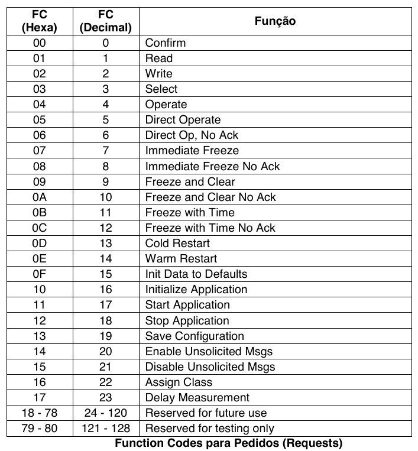
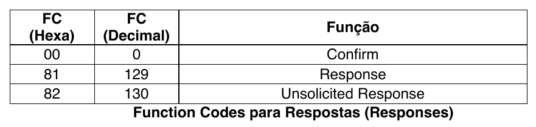
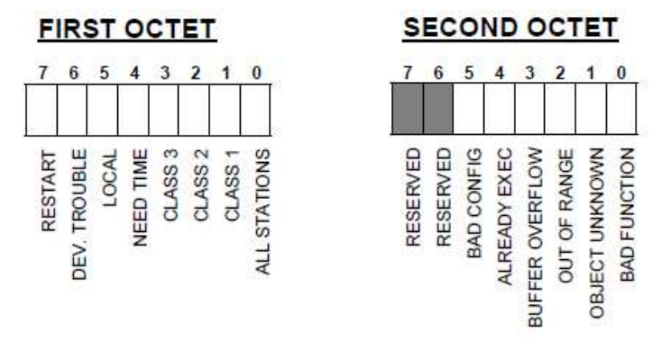
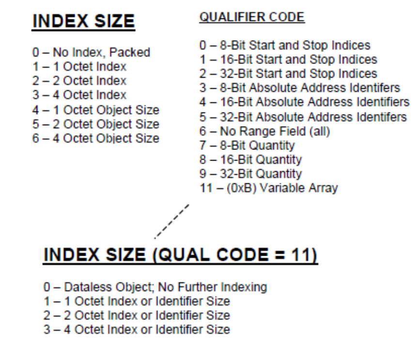
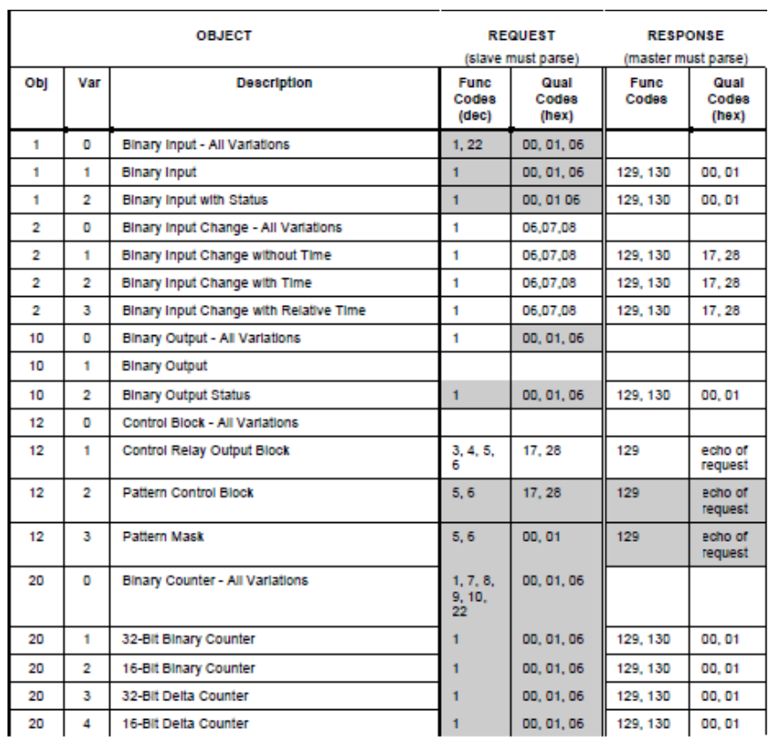

<style>
  @import url(https://fonts.googleapis.com/css?family=Source+Serif+4:200,300,regular,500,600,700,800,900,200italic,300italic,italic,500italic,600italic,700italic,800italic,900italic);

  @import url(https://fonts.googleapis.com/css?family=Source+Sans+3:200,300,regular,500,600,700,800,900,200italic,300italic,italic,500italic,600italic,700italic,800italic,900italic);

  section {
    font-family: 'Source Serif 4';
    font-weight: regular;
    color: rgb(77, 77, 77);
  }
</style>


# Protocolo de Comunicação DNP3

Prof. Lucas Silveira

---

## Introdução ao DNP3

### O que é DNP3?

- DNP 3.0 ou DNP3 (Distributed Network Protocol) é um protocolo de comunicação de dados baseado na **norma IEC 60870-5** e foi criado em 1993, pela empresa Harris. 

- É um protocolo para transmissões de dados entre `master stations` e `UTRs` (Unidades Terminais Remotas) ou `IEDs` (Dispositivos Eletrônicos Inteligentes).

---

### O que é DNP3?

- O DNP 3.0 abrange funções das **camadas de aplicação, de enlace de dados e física**, em uma arquitetura de rede simplificada, denominada `EPA` (Enhanced Performance Architecture), e possui uma *pseudo camada de transporte* junto à camada de aplicação que faz a separação de mensagens maiores que 249 bytes.

- O DNP 3.0 é um *protocolo aberto*, porém, não disponibiliza as especificações e normas no domínio público. Logo:

> Para ter acesso às suas especificações é necessário ser membro do grupo ou comprar as normas que o descrevem.

- O site oficial do grupo de estudos DNP (DNP Users Group) é o [www.dnp.org](www.dnp.org).

---

## Breve Histórico do DNP3 e suas Áreas de Aplicação

- Desenvolvido em **1993** pela **GE-Harris**  
- Usado principalmente nos setores de:
  - **Energia Elétrica**,
  - **Petróleo e Gás**,
  - **Água**, e
  - **Sistemas de Transporte**.
- É um *padrão aberto*: amplamente adotado no mundo todo.

---

## Tipos de Dados possíveis de serem representados no DNP3

- Entradas digitais,
- Entradas analógicas com conversor A/D (Analógico/Digital) para 16 ou 32 bits,
- Contadores,
- Congelamento de contadores,
- Eventos com estampa de tempo (timestamp),
- Sincronismo de tempo,
- Saídas digitais e analógicas,
- Sequência de octetos (string), 
- Entre outros.

---

## Principais Tipos de Mensagens  

- Solicitações de leitura  
- Solicitações de comando  
- Respostas de evento  
- Mensagens de confirmação  

--- 

## Tipos de objetos de dados DNP3

No DNP3 Existem objetos estáticos, como é o caso dos objetos:

- 01 (Binary Input), 
- 20 (Binary Counter),
- 30 (Analog Input) e
- 40 (Analog Output),
  
Que representam os **dados no instante da leitura**.

---

## Tipos de objetos de dados DNP3

Já os objetos:

- 02 (Binary Input Change),
- 22 (Binary Counter Change),
- 32 (Analog Input Change) e
- 42 (Analog Output Change), por exemplo,

Representam os **dados de eventos**, ou seja, apenas os dados que mudaram de valor até a última varredura do mestre.

---

## Classes de dados DNP3

O DNP3 pode agrupar estes objetos dinâmicos em 4 classes (classes 1, 2, 3 e 0), que podem ser utilizadas para priorização de eventos:

- Classe 1 `Changed Data` – Prioridade Alta
- Classe 2 `Changed Data` – Prioridade Média
- Classe 3 `Changed Data` – Prioridade Baixa
- Classe 0 `Static Data` – Todos os dados

---

## Estrutura organizacional dos dados no DNP3

- Um **ponto de dados** é:

> *Um único valor de dados do tipo especificado por seu grupo de objeto*.

- Também, dentro de cada **grupo de objeto**, existem suas **variações**. Uma **variação** é:

> *Tipicamente usada para indicar um método diferente de especificar dados dentro do grupo de objetos*.

- Por exemplo, **variações de entradas analógicas** permitem transferência dos dados com:
  - um valor 16 bits do tipo inteiro, **ou como**
  - um valor 32 bits do tipo ponto flutuante.

---

## Estrutura organizacional dos dados no DNP3

- O protocolo disponibiliza também **dois campos de Indicações Internas** (IIN – Internal Indications), que são:

> *Dois bytes que seguem o campo de função em todas as respostas e indicam alguns estados internos do escravo*, como:

- Existência de eventos (dados de classe 1, 2, 3 disponíveis),
- Reinicialização do escravo (Device Restart), 
- Pedido de sincronização de tempo (Need Time),
- Dispositivo remoto com problema (Device Trouble),
- Estouro do buffer de eventos no escravo (Buffer Overflow),
- Dentre outros.

---

## Níveis de Implementação de Dispositivos DNP3

- O DNP3 é implementado em **3 níveis nos dispositivos**, sendo que cada nível possui diferentes quantidades de objetos de dados disponibilizados.
- Essa característica deve ser especificada **na compra do equipamento** que utiliza protocolo DNP3 e depende das **necessidades do usuário**.
- Cada equipamento que utiliza o protocolo DNP3 possui um **documento de perfil do dispositivo** (Device Profile).

---

## Níveis de Implementação de Dispositivos DNP3

A norma DNP 3.0 define três níveis de implementação:

- **Nível 1** (Level 1): Nível mais simples, que define a comunicação entre uma estação Mestre ou concentrador de dados e um IED de pequeno porte.
- **Nível 2** (Level 2): Melhoria do nível anterior, que define a comunicação entre uma estação Mestre ou concentrador de dados e um IED de grande porte ou uma Unidade Terminal Remota (UTR).
- **Nível 3** (Level 3): Melhoria do nível anterior, que define a comunicação entre uma estação Mestre e um dispositivo de médio porte (por exemplo, uma Unidade Terminal Remota ou um Concentrador de Dados)

---

## Arquitetura de Camadas do DNP3

O protocolo DNP3 é baseado no modelo EPA (Enhanced Performance Architecture) e utiliza 4 camadas (Layers) de rede.

### Camadas do protocolo:

- **Aplicação**: Interpreta comandos e dados
- **Transporte**: Gerencia pacotes de dados
- **Link de dados**: Garante a integridade da comunicação
- **Física**: Transmite bits pelo meio físico

---

## Descrição das camadas

- A **Camada Física** do protocolo compreende os procedimentos de transmissão e recepção no meio físico.
- A **Camada de Enlace** de dados (Data Link Layer) possui dois propósitos: 
  - *Prover transferência de informações* (ou quadro de dados) através da conexão física. Nela o quadro de dados do usuário é transformado em um quadro de dados de enlace, com o acréscimo do **cabeçalho** e de **CRCs**.
  - *Prover indicação de outros eventos*, como o estado do enlace.

---

## Descrição das camadas

- É no cabeçalho da camada de enlace que estão os bytes de endereço fonte e destino.
- No nível de enlace não há distinção entre terminal remoto (escravo) e mestre. 
- O frame DNP 3 consiste de um cabeçalho e uma seção de dados;
- A pseudo **Camada de Transporte** segmenta mensagens da camada de aplicação em múltiplos pacotes da camada de enlace.
- Na **Camada de Aplicação** são disponibilizados vários **objetos de dados** que podem ser mapeados nos pontos de leitura (entrada) e comando (saída) de uma UTR típica de automação do sistema elétrico.

---

## Camada de Enlace (Data Link Layer) DNP3

- Utiliza os pacotes de *transmissão de dados*.
- Os pacotes de transmissão de dados seguem formatos definidos pela norma IEC 60870-5.
- Estes formatos são chamados `Transmission Frames` e possuem, geralmente, a seguinte estrutura:
  - L = Length (Campo de Tamanho) – `1 byte`
  - C = Control (Campo de Controle) – `1 byte`
  - A = Address (Campo de Endereço) – `1 ou mais bytes`
  - Link User Data (Campo de Dados) – `n bytes`

---

## Camada de Enlace (Data Link Layer) DNP3

Campos do cabeçalho da camada de enlace:

- START = 2 bytes do cabeçalho (0x0564)
- LENGTH = 1 byte representando o tamanho da mensagem, incluindo os campos CONTROL,
- DESTINATION and SOURCE do cabeçalho e o campo USER DATA. Os campos de CRC fields não são incluídos na conta do tamanho do frame. O valor deste campo vai de 5 a 255.
- CONTROL = 1 byte. O campo de controle contém informações sobre a direção da mensagem, o tipo de serviço e suporta funções de controle (Control Field).

---

## Camada de Enlace (Data Link Layer) DNP3

- DESTINATION = 2 bytes contendo o endereço de destino.
- SOURCE = 2 bytes contendo o endereço de fonte.
- CRC = 2 bytes de verificação (Cyclic Redundancy Check).
- USER DATA = Cada bloco de dados contém 16 bytes mais 2 bytes de CRC. O último bloco pode ter até 16 bytes mais 2 de CRC.

---

## Camada de Transporte DNP3

- Quando a mensagem possui dados, é necessária a utilização de uma camada de transporte, que é definida assim:
  - TH = `1 byte` de cabeçalho
  - USER DATA = Cada bloco de dados contém 16 bytes mais 2 bytes de CRC. O último bloco pode ter até 16 bytes mais 2 de CRC.

---

## Campos do Cabeçalho da Camada de Transporte DNP3

- FIN = 1 bit que indica se a mensagem é a última (1) ou se existem mais mensagens a seguir (0).
- FIR = 1 bit que indica se a mensagem é a primeira (1) ou se não é a primeira mensagem da sequência (0).
- SEQUENCE = número de sequência da camada de transporte. Varia de 0 a 63, em incrementos de 1 em 1.

---

## Camada de Aplicação

A camada de aplicação consiste de:

- **APCI** (Application Protocol Control Information)
> Contém o cabeçalho de pedido (request header) ou o cabeçalho de resposta (response header).

- **ASDU** (Application Service Data Unit)
> Contém o cabeçalho de objetos (object header) e os dados relativos aos objetos.

---

##  Application Headers

O cabeçalho de pedido (request header) é composto de dois campos:

- AP (Application Control) – 1 byte
- FC (Function Code) – 1 byte

O cabeçalho de resposta (response header) é composto de três campos:

- AP (Application Control) – 1 byte
- FC (Function Code) – 1 byte
- IIN (Internal Indications) – 2 bytes

---

## Application Control

O campo de controle é definido da seguinte forma:
- FIR = 1 bit que indica se o fragmento da mensagem é o primeiro (1) ou se não é o primeiro fragmento mensagem (0).
- FIN = 1 bit que indica se o fragmento da mensagem é o último (1) ou se existem mais fragmentos da mensagem a seguir (0).
- CON = 1 bit que indica se a mensagem precisa ser confirmada por quem a recebeu (1) ou se a mensagem não precisa ser confirmada (0).
- SEQUENCE = número de sequência do fragmento. Varia de 0 a 15, em incrementos de 1 em 1. 

No caso de mensagens não solicitadas (Unsolicited), varia de 16 a 31.

---

## Function Code

Os códigos de função utilizados para requisições DNP3.



---

## Function Code

Os códigos de função utilizados para respostas DNP3.



---

## Internal Indication

As indicações internas (IIN) são formadas por 16 bits:



---

Em que:

- ALL STATIONS = bit que indica recebimento de todas as estações.
- CLASS 1 = bit que indica que existem dados de classe 1 (Prioridade Alta) disponíveis.
- CLASS 2 = bit que indica que existem dados de classe 2 (Prioridade Média) disponíveis.
- CLASS 3 = bit que indica que existem dados de classe 3 (Prioridade Baixa) disponíveis.
- NEED TIME = bit que indica a necessidade de sincronização do relógio.
- LOCAL = bit que indica que uma ou mais saídas digitais não estão disponíveis.
- DEV. TROUBLE = bit que indica um defeito interno do IED.
- RESTART = bit que indica que o IED reiniciou.

---

- BAD FUNCTION = bit que indica que a função solicitada não existe.
- OBJECT UNKNOWN = bit que indica que o objeto solicitado não é reconhecido.
- OUT OF RANGE = bit que indica que os parâmetros dos campos de qualificador, de faixa ou de
- dados estão fora de faixa.
- BUFFER OVERFLOW = bit que indica que as filas de eventos ou de outras aplicações estão
- cheias.
- ALREADY EXEC = bit que indica que a operação solicitada ainda está sendo executada.
- BAD CONFIG = bit que indica que a configuração do IED está corrompida.

---

## Object Header

O cabeçalho de objetos (object header) é composto de três campos:

- **Object** (2 bytes)
> Define o grupo de objetos e a variação dos mesmos.

- **Qualifier** (1 byte)
> Define o qualificador dos objetos e como o campo Range será interpretado.

- **Range** (0 a 8 bytes)
> Define a quantidade de pontos, endereço inicial e final, ou indentificadores
dos pontos.

---



---

## Object Group

Uma lista de grupos de objetos, com suas variações e seus qualificadores pode ser visualizada no slide seguinte.

---



---

## Modos de Operação do DNP3

- **Polled Mode**: Mestre solicita periodicamente dados ao escravo  
- **Event Mode**: Escravo envia eventos quando ocorrem alterações significativas  

---

## Exemplo de Comunicação

- Simulação utilizando Python com visualização no Wireshark

- Simulação utilizando SCDADA LTS e IED SEL 751 com visualização no Wireshark

---

## Exercícios  

### Exercício 1: Comunicação básica  
Descreva o fluxo de comunicação entre um mestre e dois escravos em um sistema DNP3, considerando o modo de operação **Polled Mode**.  

### Exercício 2: Tipos de mensagens  
Classifique as seguintes mensagens como leitura, comando ou resposta:
1. Mestre solicita leitura da temperatura  
2. Escravo informa alteração de status de uma válvula  
3. Mestre envia comando para fechar uma válvula  

---

### Exercício 3: Arquitetura  
Explique a função de cada uma das camadas do protocolo DNP3.  

---

## Referências  
- IEEE Std 1815 – Standard for Electric Power Systems Communications – Distributed Network Protocol (DNP3)  
- Documentação oficial DNP Users Group  
- Manuais de dispositivos SCADA  

---

# Obrigado!

<!-- ## Formato das Mensagens DNP3  
### Estrutura Geral de uma Mensagem DNP3  
Cada mensagem DNP3 contém três partes principais:

1. **Cabeçalho**  
2. **Payload (dados)**  
3. **Trailer**

---

## Detalhamento do Cabeçalho  
O cabeçalho contém informações essenciais para o processamento correto da mensagem:

| Campo               | Tamanho       | Descrição                                                                 |
|---------------------|---------------|---------------------------------------------------------------------------|
| Start (0x0564)      | 2 bytes       | Sequência fixa indicando o início da mensagem                             |
| Comprimento         | 1 byte        | Indica o número total de bytes após o campo de comprimento                |
| Controle            | 1 byte        | Especifica tipo de mensagem, sequência, requisição ou resposta            |
| Endereço de destino | 2 bytes       | Identifica o dispositivo destinatário                                     |
| Endereço de origem  | 2 bytes       | Identifica o dispositivo que originou a mensagem                          |
| CRC (Cyclic Redundancy Check) | 2 bytes por bloco | Verifica a integridade dos dados                                          |

---

## Campo de Controle  
### Detalhamento do Campo de Controle  
O campo de controle é crucial para identificar o tipo de mensagem e gerenciar a comunicação.

| Bit    | Função                              | Descrição                                                                 |
|--------|-------------------------------------|---------------------------------------------------------------------------|
| 0-1    | Tipo de função                     | 00 = solicitação, 01 = resposta                                           |
| 2      | Final de mensagem (FIN)            | Indica se a mensagem é a última em uma sequência                          |
| 3      | Início de mensagem (FIR)           | Indica se a mensagem é a primeira em uma sequência                        |
| 4      | Confirmar recebimento (CON)        | Requisição de confirmação                                                 |
| 5-7    | Número de sequência                | Numeração para controle de sequência entre mestre e escravo               |

---

## Payload  
O payload contém os dados da mensagem, divididos em:

1. **Objeto de Dados**  
   Cada objeto de dados contém:  
   - Identificador do tipo de objeto  
   - Variantes de dados (tamanho e formato)  
   - Dados associados

2. **Grupos e Variantes**  
   DNP3 organiza os dados em grupos e variantes, onde:  
   - **Grupo**: Define o tipo de dado (ex.: status binário, contadores, entradas analógicas)  
   - **Variante**: Define o tamanho ou formato do dado (ex.: 8, 16 ou 32 bits)  

Exemplo:  
- Grupo 1, Variante 1: Status binário em 1 bit  
- Grupo 30, Variante 2: Entrada analógica em 16 bits  

---

##  Trailer  
O trailer contém:

- **CRC (Cyclic Redundancy Check)**  
  Utilizado para garantir a integridade dos dados transmitidos.  
  Cada bloco de 16 bytes inclui um CRC de 2 bytes.

---

##  Exemplo de Mensagem DNP3  
### Exemplo de Leitura de Entrada Analógica  
**Cenário**: Um mestre solicita ao escravo a leitura de uma entrada analógica.  

#### Mensagem de solicitação (mestre → escravo)  
```plaintext
Start: 0x0564  
Comprimento: 10 bytes  
Controle: FIR, FIN, solicitação  
Endereço de destino: 0x0002 (escravo)  
Endereço de origem: 0x0001 (mestre)  
CRC: calculado para cada bloco  
Dados:  
  Grupo: 30 (Entrada analógica)  
  Variante: 2 (16 bits)  
  Índice: 0 (primeira entrada analógica)
```

#### Mensagem de resposta (escravo → mestre)  
```plaintext
Start: 0x0564  
Comprimento: 12 bytes  
Controle: FIR, FIN, resposta  
Endereço de destino: 0x0001 (mestre)  
Endereço de origem: 0x0002 (escravo)  
CRC: calculado para cada bloco  
Dados:  
  Valor da entrada analógica: 32768 (0x8000 em hexadecimal)
```

---

##  Exercícios sobre Formato de Mensagens  

### Exercício 1: Estrutura da mensagem  
Dado o seguinte cabeçalho hexadecimal de uma mensagem DNP3:  
`0564 0A 23 0003 0001`  
1. Identifique o endereço de destino.  
2. Qual é o comprimento total da mensagem?  
3. A mensagem é uma solicitação ou uma resposta?

### Exercício 2: Controle de sequência  
Explique a importância dos bits de controle FIR e FIN no campo de controle de uma mensagem DNP3.

### Exercício 3: Análise de objeto de dados  
Uma mensagem contém o objeto `Grupo 1, Variante 1`.  
1. Qual tipo de dado está sendo transmitido?  
2. Qual o tamanho esperado dos dados?  

--- -->